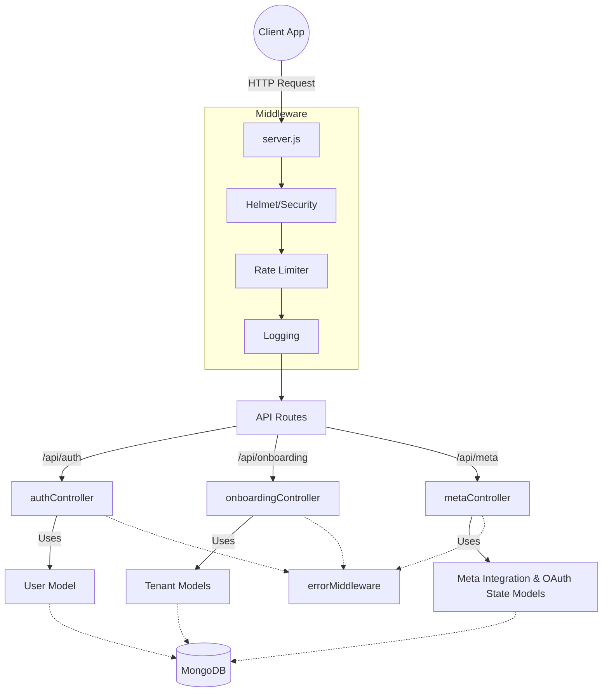

# GrowthOS Backend

Central technical documentation for the GrowthOS Node.js / Express backend API.

## Architecture & Data Flow

The backend employs a Model-Controller-Routes architecture with centralized error handling and middleware.

## API Routes & Endpoints

- `/api/auth`: Registration, Login, and Password Reset flow.
- `/api/onboarding`: Tenant setup and onboarding workflow.
- `/api/users`: User management endpoints.
- `/api/meta`: Meta Integration Endpoints (Phase 1 & Phase 2):
  - **Phase 1 — Connection & Authorization**:
    - `GET /api/meta/connect`: Protected endpoint to initiate Meta Login for Business OAuth.
    - `GET /api/meta/callback`: Public callback endpoint handling Meta authorization code exchange.
    - `GET /api/meta/status`: Protected endpoint returning connection status and granted permissions.
    - `DELETE /api/meta/disconnect`: Protected endpoint to disconnect Meta integration.
  - **Phase 2 — Asset Discovery & Data Integration**:
    - `GET /api/meta/assets`: Discovers accessible Facebook Pages, Instagram Accounts, Ad Accounts, and capability flags.
    - `GET /api/meta/pages`: Lists accessible Facebook Pages.
    - `GET /api/meta/pages/:pageId`: Details for a Facebook Page.
    - `GET /api/meta/pages/:pageId/posts`: Page posts (paginated).
    - `GET /api/meta/pages/:pageId/insights`: Page-level metrics (`page_views_total`).
    - `GET /api/meta/instagram`: Lists connected Instagram Professional accounts.
    - `GET /api/meta/instagram/:instagramAccountId/media`: Instagram media posts (paginated).
    - `GET /api/meta/instagram/:instagramAccountId/insights`: Instagram account metrics (`impressions`, `reach`, `profile_views`, `follower_count`).
    - `GET /api/meta/ad-accounts`: Lists accessible Meta Ad Accounts.
    - `GET /api/meta/ad-accounts/:adAccountId/campaigns`: Campaigns under an Ad Account (paginated).
    - `GET /api/meta/ad-accounts/:adAccountId/adsets`: Ad Sets under an Ad Account / Campaign (paginated).
    - `GET /api/meta/ad-accounts/:adAccountId/ads`: Ads under an Ad Account / Ad Set (paginated).
    - `GET /api/meta/ad-accounts/:adAccountId/insights`: Ads performance insights (spend, impressions, reach, clicks, CTR, CPC, CPM).
  - **Phase 3 — GROmentum Insights & Data Delivery**:
    - `GET /api/meta/insights/overview`: Executive overview across Social and Ads performance metrics with capability headers.
    - `GET /api/meta/insights/social`: Unified performance metrics for Facebook Pages and Instagram Accounts.
    - `GET /api/meta/insights/content`: Consolidated post & media content insights list with reverse-chronological date filtering.
    - `GET /api/meta/insights/ads`: Advertising Insights for Ad Accounts with derived CTR, CPC, CPM, and CPA calculations.
    - `GET /api/meta/insights/campaigns`: Campaign-level performance breakdown with currency subunit conversion (`dailyBudgetFormatted`, `lifetimeBudgetFormatted`).

## Guidelines
See `AI_GUIDELINES.md` for AI and developer contribution rules. Check `CHANGES_TIMELINE.md` for a historical log of implementations.

