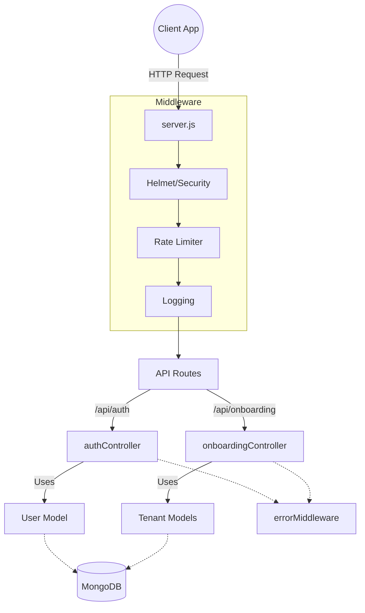

# GrowthOS Backend

Central technical documentation for the GrowthOS Node.js / Express backend API.

## Architecture & Data Flow

The backend employs a Model-Controller-Routes architecture with centralized error handling and middleware.

## Guidelines
See `AI_GUIDELINES.md` for AI and developer contribution rules. Check `CHANGES_TIMELINE.md` for a historical log of implementations.
